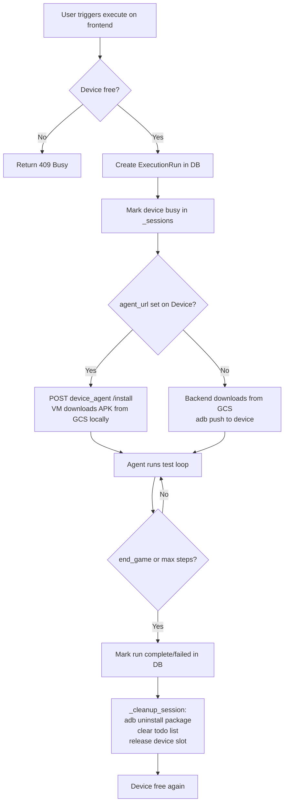

# Device Management System

## Current State (what already works)

- `Device` model in `[src/models/device.py](src/models/device.py)` has `device_id` (stable slug), `udid` (ADB serial), `adb_host`, `adb_port`
- `GET /api/devices` already returns `status: "busy" | "free"` via `execution_service.is_device_busy(d.udid)`
- Execute endpoint in `[src/routes/test_scenarios.py](src/routes/test_scenarios.py)` picks a device by `device_id` and rejects if busy
- `_cleanup_session` in `[src/services/execution_service.py](src/services/execution_service.py)` (line 495) has a `TODO` for APK uninstall

---

## Problem 1: Unstable Waydroid UDID

Waydroid's ADB serial is its LXC container IP (e.g. `192.168.240.112:5555`) which changes on restart, breaking the `udid` stored in DB.

**Fix — stable local port alias per device:**

- Parameterize `waydroid_setup.sh` with `DEVICE_INDEX` (0, 1, …)
- After `adb connect <waydroid-ip>:5555`, create a stable local forward: `adb -s <waydroid-ip>:5555 forward tcp:$((5555 + DEVICE_INDEX * 10)) tcp:5555`
- Register each device with `udid=127.0.0.1:$PORT` (e.g. `127.0.0.1:5555`, `127.0.0.1:5565`)
- Write a systemd unit (`waydroid-adb-reconnect@.service`) that re-runs `adb connect` + `adb forward` on boot so the stable port survives restarts

---

## Problem 2: Multi-Instance on One VM

Waydroid multi-instance is experimental (needs separate `/dev/binder0`, `/dev/binder1`). Two practical approaches:

- **Option A (recommended for now):** One Waydroid per VM, 2 VMs. Each VM exposes `adb_host=<vm-ip>`, `adb_port=5037`. Register both in DB.
- **Option B (single VM):** Separate binder devices + `WAYDROID_DATA_PATH` override. More complex but possible. Needs `binder_linux num_devices=254` (already done in the script).

The `Device` model, execute route, and `ExecutionService` already support N devices — no code changes needed for this layer. The change is purely in the setup script and VM configuration.

---

## Problem 3: GCS Download Happens on Backend, Not VM

Currently `download_apk_from_gcs` in `[src/services/android_build_runner.py](src/services/android_build_runner.py)` (line 119) downloads the APK to the backend server, then pushes it over `adb install`. This is slow (~80s download + ~259s install observed in prod).

**Fix — VM-local download via a sidecar agent:**

Add a small FastAPI sidecar (`emulator/device_agent.py`) running on each VM:

```python
# POST /install  { bucket: str, object_key: str, serial: str }
# Downloads APK locally via google-cloud-storage, runs adb install from localhost
```

Then in `android_build_runner.py`, replace `download_apk_from_gcs` + `adb_install` with:

```python
# if device has an agent_url configured:
requests.post(f"{device.agent_url}/install", json={...}, timeout=600)
```

Add `agent_url: Optional[str]` to the `Device` model. If not set, fall back to current behavior.

---

## Problem 4: No APK Cleanup After Execution

`_cleanup_session` (line 495-500 of `execution_service.py`) has this TODO:

```python
# TODO: After run (success or failure), uninstall the installed APK / clear app data on the
# device so emulators do not accumulate packages, stale state, or disk use across runs.
```

**Fix — uninstall in `_cleanup_session`:**

- Store `installed_package` on `AgentSession` (set during `create_action_executor_for_build`)
- In `_cleanup_session`, fire-and-forget `adb uninstall <package>` via `_bg_task`

---

## Problem 5: No Build Deletion/Archival

**Fix — add archive + GCS delete to builds route:**

In `[src/routes/builds.py](src/routes/builds.py)` (or create if missing):

```python
# DELETE /api/builds/{build_id}  →  set status=archived, delete GCS object
# POST /api/builds/{build_id}/archive  →  set status=archived only (keep GCS)
```

Add a `purge_old_builds(game_id, keep_n=5)` helper that archives all but the N most recent `ready` builds per channel.

---

## Problem 6: Frontend Device Panel

Already partially done — `GET /api/devices` returns `status`. Frontend needs:

- A device panel component showing each device's `label`, `status` (free/busy), and optionally which `execution_run_id` is running on it
- Expose `current_run_id` from `ExecutionService`: `_sessions` maps `device_udid → AgentSession`, so add `get_device_status()` method returning `{udid, busy, run_id}`

---

## End-to-End Execution Lifecycle (after changes)




---

## Files to Change

- `emulator/waydroid_setup.sh` — add `DEVICE_INDEX` param, stable port forward, systemd unit
- `src/models/device.py` — add `agent_url: Optional[str]`
- `src/models/execution_run.py` — track `installed_package`  
- `src/agent/__init__.py` or `AgentSession` dataclass — add `installed_package: Optional[str]`
- `src/services/android_build_runner.py` — call device agent if `agent_url` present
- `src/services/execution_service.py` — fill the `_cleanup_session` TODO, expose `get_device_status()`
- `src/routes/devices.py` — include `current_run_id` in device list response
- `src/routes/builds.py` — add archive + delete endpoints
- `emulator/device_agent.py` — new lightweight FastAPI sidecar (optional but high-impact for speed)

