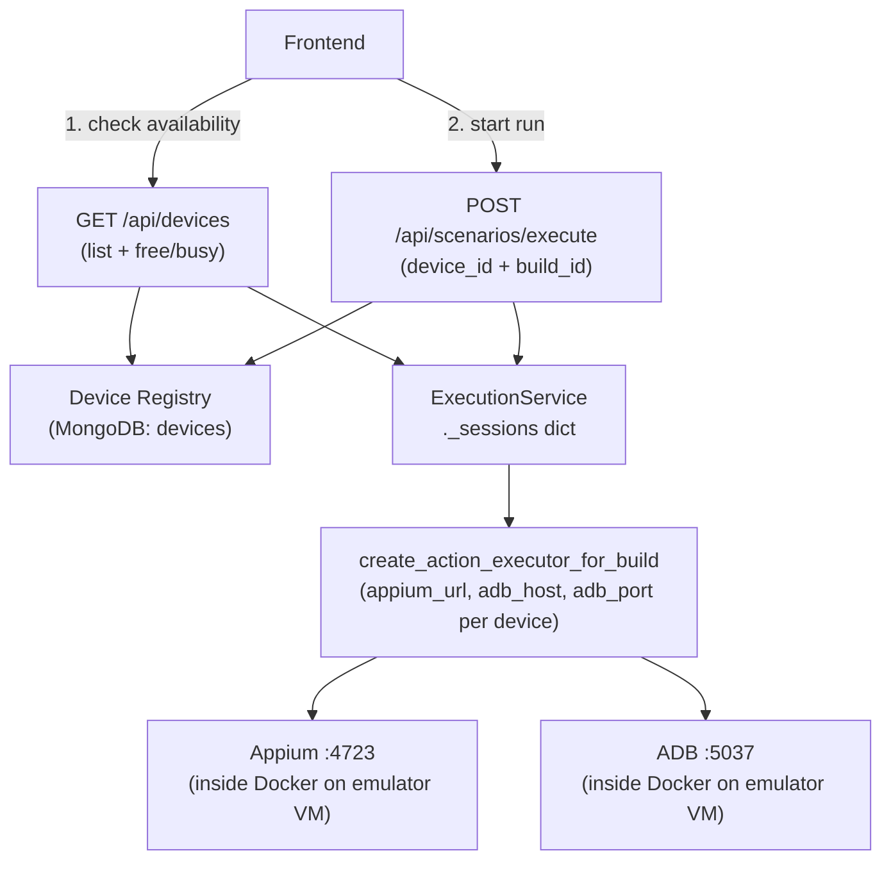

# Device Registry Implementation

## Architecture




---

## Part 1: Backend code changes

### New: `src/models/device.py`

Beanie document. Collection name: `devices`.

```python
class Device(Document):
    device_id: str          # "emulator-1", unique slug used by frontend
    label: str              # display name, e.g. "Emulator 1"
    udid: str               # ADB serial, e.g. "emulator-5554"
    adb_host: str           # emulator VM private IP
    adb_port: int = 5037
    appium_url: str         # "http://10.0.0.11:4723"
    platform: str = "android"
    enabled: bool = True
    created_at: datetime

    class Settings:
        name = "devices"
        indexes = ["device_id", "udid"]
```

### New: `src/repositories/device_repository.py`

- `find_all() -> List[Device]`
- `find_by_id(device_id) -> Optional[Device]`
- `find_by_udid(udid) -> Optional[Device]`
- `create(...) -> Device`
- `delete(device_id)`

### New: `src/routes/devices.py`

- `GET /api/devices` — all enabled devices with `status: "free" | "busy"` from `ExecutionService.is_device_busy(device.udid)`
- `POST /api/devices` — register a device
- `DELETE /api/devices/{device_id}`
- `GET /api/devices/{device_id}/health` — calls ppadb to check ADB reachability + HTTP GET to Appium URL; returns `{ adb_reachable, appium_reachable, device_online }`

### Change: `[src/database.py](src/database.py)`

Add `Device` to `document_models` in `init_beanie(...)`.

### Change: `[src/api/main.py](src/api/main.py)`

```python
from routes.devices import router as devices_router
app.include_router(devices_router)
```

### Change: `[src/routes/test_scenarios.py](src/routes/test_scenarios.py)`

```python
# Before
class ExecuteRequest(BaseModel):
    device_udid: str
    build_id: str

# After
class ExecuteRequest(BaseModel):
    device_id: str     # frontend sends slug; backend resolves to udid + endpoints
    build_id: str
```

In execute handler: look up `Device` by `device_id`, check `enabled`, check `is_device_busy(device.udid)`, pass full `Device` object into `start_execution`.

### Change: `[src/services/execution_service.py](src/services/execution_service.py)`

```python
# Before
async def start_execution(self, run_id, scenario, game, device_udid: str, build):

# After
async def start_execution(self, run_id, scenario, game, device: Device, build):
```

Pass `device.appium_url`, `device.adb_host`, `device.adb_port` into `create_action_executor_for_build`. Internal keys (`_sessions`, `AgentSession.device_udid`) stay as `device.udid` — no rename needed.

### Change: `[src/services/android_build_runner.py](src/services/android_build_runner.py)`

```python
# Before — reads from module-level globals ADB_HOST, ADB_PORT and os.getenv("APPIUM_URL")
def create_action_executor_for_build(*, device_udid, build, use_appium):

# After — explicit per-device params
def create_action_executor_for_build(
    *,
    device_udid: str,
    appium_url: str,
    adb_host: str,
    adb_port: int,
    build: Build,
    use_appium: bool,
) -> Any:
```

`_adb_client()` accepts `adb_host`/`adb_port` as params instead of reading module-level globals. Global env vars (`ADB_HOST`, `ADB_PORT`, `APPIUM_URL`) become fallback defaults for local dev only.

### Local dev fallback

Seed one device entry in MongoDB pointing at `localhost` for laptop testing — no code-path change needed.

```json
{
  "device_id": "local",
  "label": "Local Device",
  "udid": "RZCW31HH47R",
  "adb_host": "127.0.0.1",
  "adb_port": 5037,
  "appium_url": "http://localhost:4723",
  "platform": "android",
  "enabled": true
}
```

---

## Part 2: Emulator VM — Docker container

The emulator VM runs a single Docker container. Your backend is not here. The container exposes ADB and Appium to the backend over the VPC private network.

Docker on Linux with `--device /dev/kvm` gives the container hardware-accelerated KVM — the emulator runs at full speed.

### `emulator/Dockerfile`

```dockerfile
FROM ubuntu:22.04

ENV DEBIAN_FRONTEND=noninteractive
ENV ANDROID_HOME=/opt/android-sdk
ENV ANDROID_AVD_HOME=/root/.android/avd
ENV PATH=$PATH:$ANDROID_HOME/cmdline-tools/latest/bin:$ANDROID_HOME/platform-tools:$ANDROID_HOME/emulator

RUN apt-get update && apt-get install -y \
    openjdk-17-jdk wget unzip curl \
    libgl1-mesa-glx libpulse0 libx11-6 \
    && curl -fsSL https://deb.nodesource.com/setup_20.x | bash - \
    && apt-get install -y nodejs \
    && rm -rf /var/lib/apt/lists/*

RUN mkdir -p $ANDROID_HOME/cmdline-tools && \
    wget -q https://dl.google.com/android/repository/commandlinetools-linux-11076708_latest.zip \
        -O /tmp/cmdline-tools.zip && \
    unzip -q /tmp/cmdline-tools.zip -d $ANDROID_HOME/cmdline-tools && \
    mv $ANDROID_HOME/cmdline-tools/cmdline-tools $ANDROID_HOME/cmdline-tools/latest && \
    rm /tmp/cmdline-tools.zip

RUN yes | sdkmanager --licenses && \
    sdkmanager "platform-tools" "emulator" \
        "platforms;android-34" \
        "system-images;android-34;google_apis;x86_64"

RUN npm install -g appium && appium driver install uiautomator2

COPY entrypoint.sh /entrypoint.sh
RUN chmod +x /entrypoint.sh

# ADB server + Appium
EXPOSE 5037 4723

ENTRYPOINT ["/entrypoint.sh"]
```

### `emulator/entrypoint.sh`

```bash
#!/bin/bash
set -e

AVD_NAME=${AVD_NAME:-pixel_device_1}
APPIUM_PORT=${APPIUM_PORT:-4723}

# Create AVD only on first boot — volume persists it across restarts
if ! avdmanager list avd | grep -q "$AVD_NAME"; then
    echo "no" | avdmanager create avd \
        -n "$AVD_NAME" \
        -k "system-images;android-34;google_apis;x86_64" \
        -d "pixel_6"
fi

# Start ADB server bound to all interfaces so the backend can reach port 5037
adb -a -P 5037 nodaemon server &

# Boot emulator — requires /dev/kvm on the host VM
emulator -avd "$AVD_NAME" \
    -no-window -no-audio \
    -gpu swiftshader_indirect \
    -memory 3072 \
    -no-snapshot \
    -no-boot-anim &

echo "Waiting for emulator to boot..."
adb wait-for-device shell \
    'while [[ "$(getprop sys.boot_completed)" != "1" ]]; do sleep 2; done'

adb shell settings put global window_animation_scale 0
adb shell settings put global transition_animation_scale 0
adb shell settings put global animator_duration_scale 0

echo "Emulator ready. Starting Appium on port $APPIUM_PORT..."
exec appium --address 0.0.0.0 --port "$APPIUM_PORT" --log-timestamp --log-no-colors
```

### Running on the emulator VM

```bash
# Build image
docker build -t emulator-node ./emulator

# Run device 1
docker run -d \
    --name emulator-1 \
    --device /dev/kvm \
    --privileged \
    -p 5037:5037 \
    -p 4723:4723 \
    -v avd-data-1:/root/.android \
    -e AVD_NAME=pixel_device_1 \
    -e APPIUM_PORT=4723 \
    --restart=always \
    emulator-node
```

`--restart=always` replaces systemd — Docker restarts the container on crash or VM reboot.

`-v avd-data-1:/root/.android` persists the AVD so it is not recreated on every restart.

### Second device on the same VM

Same image, different host ports and volume:

```bash
docker run -d \
    --name emulator-2 \
    --device /dev/kvm \
    --privileged \
    -p 5038:5037 \
    -p 4724:4723 \
    -v avd-data-2:/root/.android \
    -e AVD_NAME=pixel_device_2 \
    -e APPIUM_PORT=4723 \
    --restart=always \
    emulator-node
```

Device registry entry for device 2: `adb_port=5038`, `appium_url=http://<vm-ip>:4724`

### Firewall rules on the emulator VM

Only allow traffic from the backend VM's private IP:


| Port | Purpose                         |
| ---- | ------------------------------- |
| 5037 | ADB server (device 1)           |
| 4723 | Appium (device 1)               |
| 5038 | ADB server (device 2, optional) |
| 4724 | Appium (device 2, optional)     |


Never expose on the public interface.

### Local Mac testing (Apple Silicon)

You cannot boot an x86_64 Android emulator inside Docker on Apple Silicon — no `/dev/kvm` available.

What you can do on Mac:

- `docker build -t emulator-node ./emulator` — verifies Dockerfile builds, SDK and Appium install correctly
- Run backend normally with your physical device or native Android Studio AVD
- Seed a local device registry entry pointing at `127.0.0.1` for full API flow testing
- Deploy to the Linux KVM cloud VM for actual emulator-in-Docker validation

