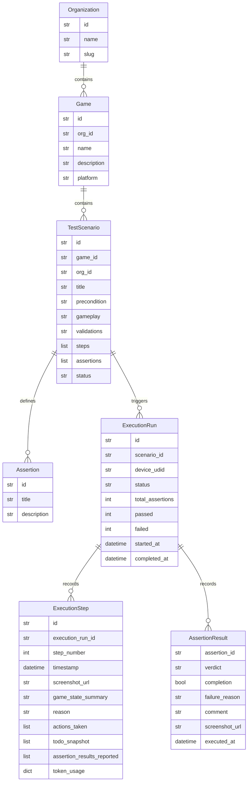
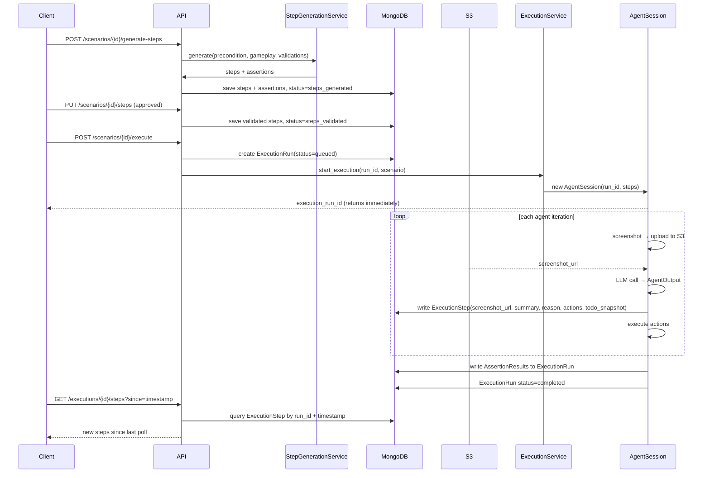

# English to Execution Backend

## What Already Exists (keep as-is)

- `src/tools/todo_management/` — step execution mechanism, this IS the step runtime
- `src/agent/context/context_service.py` — LLM context management
- `src/agent/action_handler.py`, `adb_manager.py`, `appium_manager.py` — device layer
- `src/models/test_run.py` — being superseded by `ExecutionRun` + `ExecutionStep`
- `src/database.py` — MongoDB/Beanie init (needs new models registered)

---

## Data Model




**Naming clarified:**

- `TestScenario` — the thing the QA writes in English (replaces `TestCase`). Contains the English input fields, generated steps, and assertion definitions.
- `Assertion` — each individual checkable condition inside a scenario (e.g. "1.1 New Player Login"). Stored on `TestScenario`, stable across runs.
- `AssertionResult` — the outcome of one assertion in one run. Stored on `ExecutionRun`.
- `ExecutionStep` — one row per agent iteration (screenshot → LLM → actions). Separate table for real-time polling.

`**TestScenario.status` lifecycle:**
`draft` → `steps_generated` → `steps_validated` → `running` → `completed | failed`

`**TestScenario` English input fields** (what the QA fills in):

- `precondition` — where the game needs to be when the test starts (e.g. "Player is logged in and on the main world map")
- `gameplay` — what the agent should do (e.g. "Navigate to Catalina City and complete a bingo round")
- `validations` — what to assert (e.g. "Verify the round summary screen appears")

These three fields feed the step generation LLM.

`**TestScenario.steps`** (stored as `List[Step]`, loaded as the agent's todo list on execution):

```python
class Step(BaseModel):
    id: str
    content: str
    step_type: Literal["action", "verify"]
    order: int
    dependencies: List[str] = []
```

`**ExecutionStep` indexes:**

- Compound index on `(execution_run_id, timestamp)` — covers timeline fetch and incremental polling
- Index on `step_number` — for direct step lookup

---

## New File Structure

```
src/
  models/
    organization.py           # NEW
    game.py                   # NEW
    test_scenario.py          # NEW (replaces test_case.py)
    execution_run.py          # NEW (supersedes test_run.py)
    execution_step.py         # NEW
  services/
    step_generation_service.py   # NEW: English → Steps + Assertions via LLM
    execution_service.py         # NEW: agent session management per run
  repositories/
    organization_repository.py   # NEW
    game_repository.py           # NEW
    test_scenario_repository.py  # NEW (replaces test_case_repository.py)
    execution_repository.py      # NEW (replaces test_run_repository.py)
    execution_step_repository.py # NEW
  routes/
    orgs.py               # NEW
    games.py              # NEW
    test_scenarios.py     # NEW (replaces routes/api.py)
    executions.py         # NEW
  agent/
    service.py            # UPDATE: de-globalize into AgentSession
  api/
    main.py               # UPDATE: register new routers
  database.py             # UPDATE: register new models
```

---

## API Endpoints

**Orgs & Games**

- `POST /api/orgs` — create org, returns `org_id` + `slug`
- `GET /api/orgs/{org_id}/games`
- `POST /api/orgs/{org_id}/games`

**Test Scenarios**

- `POST /api/games/{game_id}/scenarios` — body: `{ title, precondition, gameplay, validations }`
- `GET /api/games/{game_id}/scenarios`
- `GET /api/scenarios/{scenario_id}`

**English → Execution Flow**

- `POST /api/scenarios/{scenario_id}/generate-steps` — LLM call, returns steps + assertions, status → `steps_generated`
- `PUT /api/scenarios/{scenario_id}/steps` — user submits approved/edited steps + assertions, status → `steps_validated`
- `POST /api/scenarios/{scenario_id}/execute` — body: `{ device_udid }`, returns `execution_run_id` immediately (async)
- `GET /api/scenarios/{scenario_id}/executions` — list runs

**Execution Polling**

- `GET /api/executions/{execution_run_id}` — status + assertion_results summary
- `GET /api/executions/{execution_run_id}/steps` — paginated step timeline (for real-time UI)
- `GET /api/executions/{execution_run_id}/steps?since=<timestamp>` — incremental poll for new steps only

---

## Step Generation Service

New file: `src/services/step_generation_service.py`

- Takes `precondition` + `gameplay` + `validations` + `game.description`
- Single LLM call to Gemini with structured output
- Returns `List[Step]` (the agent todo list) and `List[Assertion]` (the named checks the agent will report on)

```python
class GeneratedOutput(BaseModel):
    steps: List[Step]
    assertions: List[Assertion]  # e.g. [{"id": "1.1", "title": "New Player Login", "description": "..."}]
    summary: str
```

---

## Agent De-globalization + ExecutionStep Persistence

`src/agent/service.py` currently uses module-level globals. Changes:

- Wrap agent state into `AgentSession` dataclass: holds `session_id`, `context_service` instance, `execution_run_id`, `force_annotate`
- `ExecutionService` holds `active_sessions: Dict[str, AgentSession]` keyed by `device_udid`
- `agent_handler` and `execute_agent_actions` become methods of `AgentSession`
- After each agent iteration, write one `ExecutionStep` to MongoDB (screenshot uploaded to S3 first, URL stored)
- On `end_game`: write `AssertionResult` list to `ExecutionRun`, set status `completed`
- On startup: mark any stuck `running` executions as `failed`




---

## Auth (Obfuscation Only)

- Each org gets a `slug` (e.g. `org_xk9p2m`) on creation
- All routes require `X-Org-Slug` header — validated against DB, no JWT
- Attaches `org_id` to request state for downstream filtering

---

## Key Files to Modify

- `[src/agent/service.py](src/agent/service.py)` — de-globalize into `AgentSession` class
- `[src/models/test_case.py](src/models/test_case.py)` — superseded by `test_scenario.py`
- `[src/api/main.py](src/api/main.py)` — register routers
- `[src/database.py](src/database.py)` — register new models

## Deferred (not in this scope)

- Cron scheduling / CI-CD webhooks
- Real authentication (JWT/OAuth)
- Crash-resume: persisting todo list state mid-run for recovery
- Context setup via debug API (navigation pre-steps are `precondition` text only for now)

