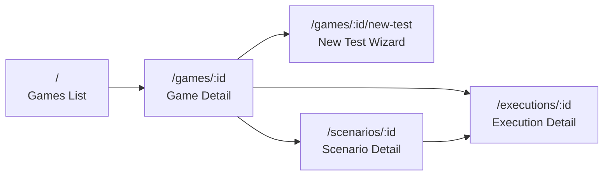
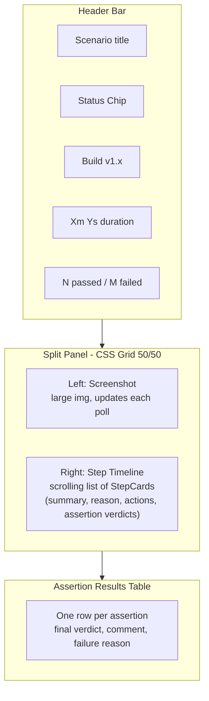

# QA Frontend — React + MUI

Todo: I want to add a voice that tells that the run is over. (for notification)

## Stack

- **React + Vite** — project root at `frontend/`
- **MUI v5** (`@mui/material`, `@mui/icons-material`, `@emotion/react`)
- **TanStack Query v5** — all data fetching and polling
- **React Router v6** — client-side routing
- **Axios** — HTTP client with `X-Org-Slug` header injected globally

`VITE_API_BASE_URL` and `VITE_DEVICE_UDID` (hardcoded for now) live in `frontend/.env.local`.

---

## Route Map




---

## Pages

### 1. Games List `/`

- `GET /api/orgs/:org_id/games` — MUI `Grid` of `Card` components
- Each card: game name, platform `Chip`, scenario count, last run status dot
- "Add Game" `Button` → `Dialog` with name + platform `Select`

### 2. Game Detail `/games/:id` — 4 MUI `Tabs`

**Agent Prompt tab**

- Multi-line `TextField` for game description and gameplay style
- "Save" calls `PATCH /api/orgs/:org_id/games/:game_id` *(new backend endpoint)*

**Builds tab**

- `Table`: version, uploaded date, actions (delete)
- "Upload Build" `Button` → `Drawer` with version `TextField` + APK `<input type="file">`
- Calls `POST /api/games/:game_id/builds` (multipart) and `GET /api/games/:game_id/builds` *(new)*
- *Add tag here for environments*

**Test Scenarios tab**

- `Table`: title, status `Chip`, last run date, passed/failed counts, Edit + Rerun actions
- "New Test" `Button` → navigates to wizard
- Rerun opens a small `Dialog`: pick build from dropdown → calls `POST /api/scenarios/:id/execute`
- Data from `GET /api/games/:game_id/scenarios`

**Executions tab**

- `Table`: scenario title, build version, status `Chip`, duration, passed/failed, started at
- Row click → navigate to `/executions/:id`
- Data from `GET /api/games/:game_id/executions` *(new backend endpoint)*

---

### 3. New Test Wizard `/games/:id/new-test`

MUI `Stepper` with 3 steps:

**Step 1 — Describe**

- Fields: title, precondition, "what to do", "what to verify", build picker (dropdown from `GET /api/games/:game_id/builds`)
- "Generate Steps" → `POST /api/games/:game_id/scenarios` then `POST /api/scenarios/:id/generate-steps`
- Shows `LinearProgress` while LLM generates

**Step 2 — Review**

- Two columns: Steps list (left) and Assertions list (right)
- Inline editable rows (`TextField` on click), delete icon per row
- "Looks good, Run" → `PUT /api/scenarios/:id/steps` then `POST /api/scenarios/:id/execute`
- Navigates to `/executions/:run_id`

**Step 3 — Running**

- Just a redirect; Execution Detail page handles the rest

---

### 4. Execution Detail `/executions/:id`




- `GET /api/executions/:id` — header data
- `GET /api/executions/:id/steps` — TanStack Query `refetchInterval: 3000` while `status === "running"`, stops when `completed` or `failed`
- Final assertion verdict = last reported result per `assertion_id` derived on the frontend
- Screenshots served from backend static file mount (same path stored in DB)

---

### 5. Scenario Detail `/scenarios/:id`

- `GET /api/scenarios/:id` — loads all fields
- Edit title, precondition, gameplay, validations → `PATCH /api/scenarios/:id` *(new)*
- Steps `Table`: type badge (`action`/`verify`), content (inline editable), order, dependencies
- Assertions `Table`: title + description (inline editable)
- Save changes → `PUT /api/scenarios/:id/steps`
- "Run Scenario" `Button` → build picker `Dialog` → `POST /api/scenarios/:id/execute` → navigate to execution

---

## Backend Additions Required


| What                                     | Where                      | Notes                                            |
| ---------------------------------------- | -------------------------- | ------------------------------------------------ |
| `GET /api/orgs/:org_id/games/:game_id`   | `routes/games.py`          | Get single game                                  |
| `PATCH /api/orgs/:org_id/games/:game_id` | `routes/games.py`          | Update description/gameplay                      |
| `PATCH /api/scenarios/:id`               | `routes/test_scenarios.py` | Update text fields                               |
| `GameBuild` model                        | new `models/game_build.py` | `game_id, org_id, version, apk_path, created_at` |
| `GET/POST /api/games/:id/builds`         | new `routes/builds.py`     | APK stored under `uploads/apks/`                 |
| `GET /api/games/:id/executions`          | `routes/executions.py`     | List all runs for a game                         |
| `error_message: Optional[str]`           | `models/execution_run.py`  | Persist exception text on failure                |
| `build_id: Optional[str]`                | `models/execution_run.py`  | Track which build was used                       |
| Static file mount for `uploads/`         | `api/main.py`              | Serve APKs and screenshots over HTTP             |


---

## Frontend File Structure

```
frontend/
├── src/
│   ├── api/
│   │   ├── client.js           # axios instance, X-Org-Slug header
│   │   ├── games.js
│   │   ├── builds.js
│   │   ├── scenarios.js
│   │   └── executions.js
│   ├── components/
│   │   ├── layout/
│   │   │   ├── AppLayout.jsx   # sidebar + outlet
│   │   │   └── Sidebar.jsx
│   │   ├── StatusChip.jsx
│   │   └── StepCard.jsx
│   ├── pages/
│   │   ├── GamesListPage.jsx
│   │   ├── GameDetailPage.jsx
│   │   ├── NewTestWizardPage.jsx
│   │   ├── ExecutionDetailPage.jsx
│   │   └── ScenarioDetailPage.jsx
│   ├── hooks/
│   │   └── useExecutionPolling.js
│   ├── theme.js
│   ├── App.jsx
│   └── main.jsx
├── .env.local
└── package.json
```

